# 功能点 1：基础 Agent Loop（s01）
> [!note]
> 目标：观察 LLM ↔ 工具 ↔ 消息的基本往返循环 > 
##  #: 1.1
  Prompt: list all python files in this directory
  预期数据流: 
  LLM 生成 bash tool call → run_bash("ls .py") → 结果追加到 messages →LLM 返回文本
  关注点: messages 列表如何增长：user→assistant→user(tool_result)→assistant
> [!note]
> Lead Agent Loop 流程：
> （1）context 处理流程：
> ①压缩： micro compact 和 auto 
> 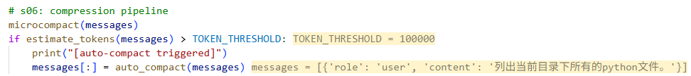
> ②取出“后台 background线程刚跑完的任务结果”
> - 整理成一条消息，塞回 messages（user），下一次调用 LLM 时，模型就能知道后台任务已经完成了。
> -  <background-results>...</background-results>标签包裹起来，告诉模型是事件通知
> 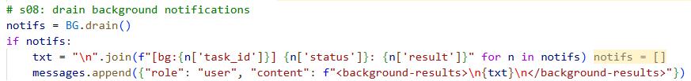
>
> ③Lead Agent 查看信箱
> - 别的 agent 往 lead 发消息时，会追加到 lead.jsonl 里；而 read_inbox("lead") 会把这个收件箱里的所有消息读出来，再清空
> - 用 <inbox>...</inbox> 包起来，提醒模型是“邮箱信息”
> - 作为 "role": "user" 追加进 messages
> 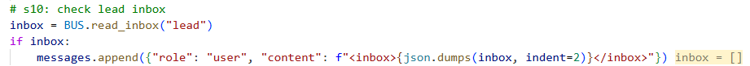
> 
> ④ LLM CALL （api 调用）
>  ```python
>  response = client.messages.create(
>             model=MODEL, system=SYSTEM, messages=messages,
>             tools=TOOLS, max_tokens=8000,
>         )
>         messages.append({"role": "assistant", "content": response.content})
>  ```
>  ```bash
>  MODEL = 'qwen-max',  
> SYSTEM = 'You are a coding agent at D:\\Dev\\Projects\\Claude_Learning\\learn-claude-code. 
> Use tools to solve tasks.\nPrefer task_create/task_update/task_list for multi-step work. Use TodoWrite for short checklists.\nUse task for subagent delegation. Use load_skill for specialized knowledge.\n
> Skills: - agent-builder: |\n - code-review: Perform thorough code reviews with security, performance, and maintainability analysis. Use when user asks to review code, check for bugs, or audit a codebase.\n - mcp-builder: Build MCP (Model Context Protocol) servers that give Claude new capabilities. Use when user wants to create an MCP server, add tools to Claude, or integrate external services.\n - pdf: Process PDF files - extract text, create PDFs, merge documents. Use when user asks to read PDF, create PDF, or work with PDF files.',  
> messages = [{'role': 'user', 'content': '列出当前目录下所有的python文件。'}]
> TOOLS = [{'name': 'bash', 'description': 'Run a shell command.', 'input_schema': {...}}, {'name': 'read_file', 'description': 'Read file contents.', 'input_schema': {...}}, {'name': 'write_file', 'description': 'Write content to file.', 'input_schema': {...}}, {'name': 'edit_file', 'description': 'Replace exact text in file.', 'input_schema': {...}}, {'name': 'TodoWrite', 'description': 'Update task tracking list.', 'input_schema': {...}}, ....., {'name': 'idle', 'description': 'Enter idle state.', 'input_schema': {...}}, {'name': 'claim_task', 'description': 'Claim a task from the board.', 'input_schema': {...}}]
>  ```
>  回复内容：
> 	 {'role': 'assistant',
> 	  'content': 
> 		  [**ThinkingBlock**(signature=None, thinking='用户要求列出当前目录下所有的Python文件。我需要使用bash命令来执行这个操作。\n\n当前目录是 D:\\Dev\\Projects\\Claude_Learning\\learn-claude-code，我需要列出所有的.py文件。\n\n我可以使用以下命令：\n- `dir *.py` (Windows)\n- `ls *.py` (Linux/Mac)\n- `find . -name "*.py"` (更全面的搜索)\n\n由于这是Windows系统（从路径可以看出），我应该使用Windows命令。不过，Git Bash或类似的工具可能也可以使用Unix命令。让我尝试使用 `find` 或 `ls` 命令，因为这些在大多数环境中都能工作。\n\n实际上，最保险的方法是使用 `dir *.py` 或者 `ls *.py`，如果使用PowerShell可能是 `Get-ChildItem *.py`。\n\n让我先尝试一个简单的命令。', type='thinking'), 
> 		  **ToolUseBlock**(id='call_5011689455b347f591484fd0', caller=None, input={'command': 'ls .py'}, name='bash', type='tool_use')]}
>
>   ⑤ Tool use block：调用 bash 工具（仅返回前 5000 个 char）
>   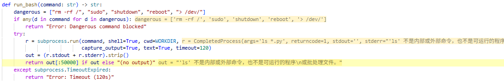
>   ```python
>   [{'type': 'tool_result', 'tool_use_id': 'call_5011689455b347f591484fd0', 'content': "'ls' 不是内部或外部命令，也不是可运行的程序\n或批处理文件。"}]
>   ```
>   
>   ⑥Todo 系统：
>   大概作用就是 存在没完成的待办 && 连续 3 轮没有更新 todo 就会塞入一个文本提醒->让模型下一轮能够看到：
>   ```bash
>   <reminder>Update your todos.</reminder>
>   ```
>   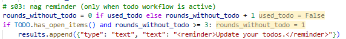
> 然后，将 tool use 的结果塞入 message
> 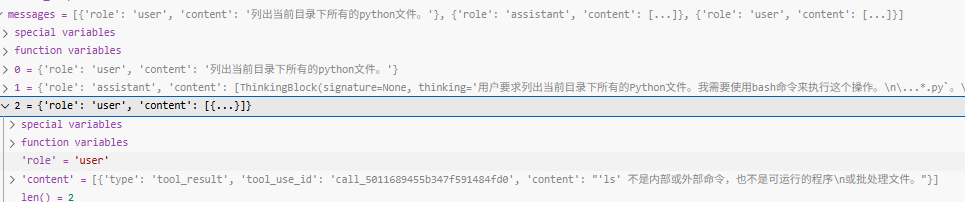
> 后续轮次：
> assissant ：tool use 调用 bash dir...
> user: 塞入 tool use 的结果
> assissant：成功，response 里面的 stop.reason == end_turn ，在 loop 中
> ```python
> if response.stop_reason != "tool_use":
>             return
> ``` 
> 成立，退出Loop。

## 1.3
  Prompt: run: echo hello && sleep 5 && echo world
  关注点: 验证同步阻塞特性，对比 后面的异步
> [!note]
> bash 阻塞 5 s，返回完整输出

## 1.4
  Prompt: rm -rf /tmp
  预期数据流: run_bash 返回 "Error: Dangerous command blocked"
  关注点: 安全过滤逻辑（dangerous 列表）是否正确
> [!note] 
> zhan keng

# 功能点 2：多工具 Dispatch（s02）
> [!note] 补充：TOOLS 变量
> TOOLS = [
>     {"name": "...", "description": "...", "input_schema": {...}},
>     ...
> ]
> - 核心三部分：
> 	- name:工具名
> 	- description：用途说明
> 	- input_schema: 参数结构定义
> 		- 本质是 JSON Schema
> 		- 告诉模型：①输入必须是 object②哪些字段③字段类型（包含枚举类型）④必填字段
> - 举个🌰：
> ```json
> {
>   "name": "TodoWrite",
>   "description": "Update task tracking list.",
>   "input_schema": {
>     "type": "object",  # 必须是一个对象
>     "properties": {    # 必须要有items
>       "items": {
>         "type": "array",  # items里面的类型必须是包含object的array
>         "items": {
>           "type": "object",
>           "properties": {  # 每一个item object必须要含有三种类型
>             "content": {"type": "string"},
>             "status": {
>               "type": "string",
>               "enum": ["pending", "in_progress", "completed"]
>             },
>             "activeForm": {"type": "string"}
>           },
>           "required": ["content", "status", "activeForm"]
>         }
>       }
>     },
>     "required": ["items"]
>   }
> }
> ```
> - 设计原则：“TOOLS 只负责声明接口”，不负责实现逻辑
> 	- TOOLS 相当于是 “函数签名” + 文档 -> 让 llm 决定用不用以及怎么用？
> 	- TOOL_HANDLERS 是真正的函数体  -> 程序负责执行与校验结果
目标：观察 TOOL_HANDLERS 路由机制，文件读写的 safe_path 沙箱
##  2.1
Prompt: create a file called debug_test.txt with content "hello world"
预期数据流: LLM 调用 write_file → run_write → 创建文件 → "Wrote N bytes" 返回
关注点: TOOL_HANDLERS dict 路由：block.name 决定走哪个 handler
> [!note] 
> ```python
> for block in response.content:
>        if block.type == "tool_use":
>                 if block.name == "compress":
>                     manual_compress = True
>                 handler = TOOL_HANDLERS.get(block.name)
>                 try:
>                     output = handler(**block.input) if handler else f"Unknown tool: {block.name}"
> ```
> thinking block 跳过~
> 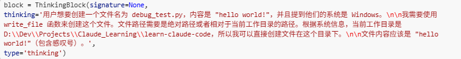
> toolUse Block 进入分支：
> `ToolUseBlock(id='call_2a99903357cb4414a3394bd1', caller=None, input={'path': 'debug_test.py', 'content': 'hello world!'}, name='write_file', type='tool_use')`
>  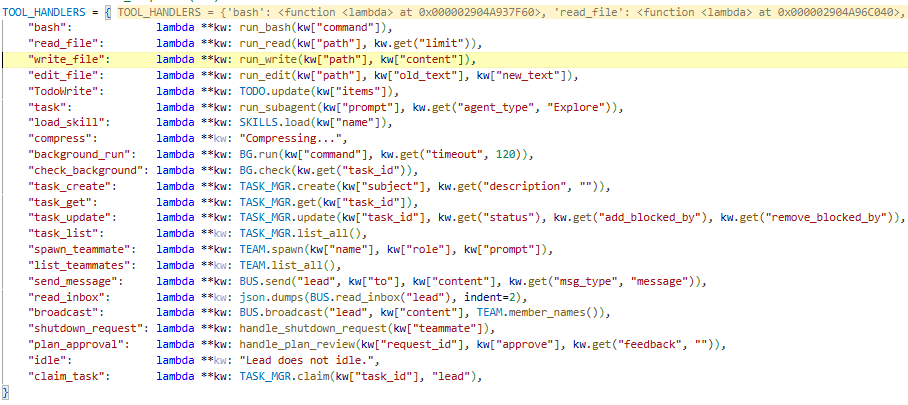
>  从 tool_handlers 索引对应的函数：
>  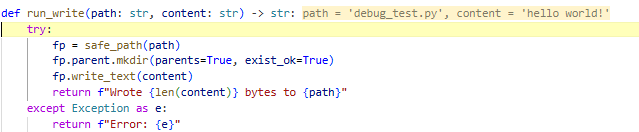
>  执行，返回结果。

  #: 2.2
  Prompt: read the file agents/s01_agent_loop.py (first 10 lines only)
  预期数据流: LLM 调用 read_file(path, limit=10) → 返回截断内容
  关注点: limit 参数是否被 LLM 正确传入，run_read 的切片逻辑
✅️
  
  #: 2.3
  Prompt: edit debug_test.txt: replace "hello world" with "goodbye world"
  预期数据流: LLM 调用 edit_file(old_text, new_text)
  关注点: old_text not in content 的 Error path
✅️
  
  #: 2.4
  Prompt: read file ../../../etc/passwd
  预期数据流: safe_path 抛出 ValueError: Path escapes workspace
  关注点: 沙箱隔离：path.is_relative_to(WORKDIR) 检查
> [!note] 
> 安全功能 暂时跳过~
> 简单来说：
> 检查解析后的真实路径，是不是还在工作区里面。  如果已经“逃出”项目目录了，就报错
# 功能点 3：Todo 自我规划（s03）
> [!note]
> Todo 系统解决的是 agent 常见的几个问题：
> - 多步骤任务里，模型容易忘记自己做到哪
> - 做到一半时，口头计划和实际执行脱节
> - 用户很难看出 agent 当前在干什么
> - 模型可能同时展开太多支线，失焦
> 
> **设计细节：**
> - 每一个 todo 都是由 TodoManager 来管理的，存放在 items 列表下
> - 每个 todo 至少有 content、status、activeForm 字段
> 	- content：任务内容
> 	- status：pending/ in_process/ completed（同一时间只能有一个 in_process）
> 	- activeForm：正在做的动作列表（方便 render 渲染 动态的 todo 列表）
> - 相关工具：TodoWrite 创建 todo 和更新 todo
> - TodoManager
> 	- update 方法：接收一组 items-> 先 validate -> 整体替换（完整快照+合法性）
> 	- render 格式化输出：
> 		-  .[ ] pending [>] in_process ->activeForm  [x] completed
> 		- 进度统计 (2/5 completed)
> 	- has_open_items( ): 判断工作流是否还活着
> 		- 只要还有任何未完成项，这个 todo 工作流就算还在进行中。
> 		- nag reminder 根据这个状态 决定是否 要在 message 里面 “催一催”
> 			- 每一轮 loop 会记录是否使用 TodoWrite 工具，用了->use_todo=True；没有用：`rounds_without_todo` 累计
> 			- `if has_open_items( )存在未完成 and rounds_without_todo >= 3` :工具结果会塞入 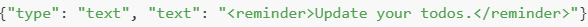
> todo 机制的作用就是：
> - 把计划显式化
> - 把执行状态结构化
> - 把“当前焦点”限制为一个
> - 用 reminder 逼模型维护这份状态
> 
> **测试目标**：观察 TodoManager 状态机 + nag reminder 注入机制

  #: 3.1
  Prompt: create a simple calculator in python: add, subtract, multiply, divide
  预期数据流: LLM 先调用 todo 创建任务列表 → 逐步执行 → 每步 mark
    in_progress/completed
  关注点: rounds_since_todo 计数器如何累积，TODO.render() 的输出格式>
> [!note]
 ①第一轮的tool use：
  [*ThinkingBlock*(signature=None, thinking='用户想用Python创建一个简单的计算器，包含加减乘除四个功能。用户要求：\n1. 先用TodoWrite规划每一步\n2. 写一个功能测试一个功能\n3. 成功就把todo划掉\n\n让我先创建一个todo列表来规划这个任务。', type='thinking'), *TextBlock*(citations=None, text='我来帮你创建一个简单的Python计算器！先规划一下每一步：', type='text'), 
  *ToolUseBlock*(id='019dba151949100fdff2f755f4ec5da0', caller=None, input={'items': [{'content': '创建calculator.py文件，定义add函数并测试', 'status': 'pending', 'activeForm': '创建add函数'}, {'content': '定义subtract函数并测试', 'status': 'pending', 'activeForm': '创建subtract函数'}, {'content': '定义multiply函数并测试', 'status': 'pending', 'activeForm': '创建multiply函数'}, {'content': '定义divide函数并测试（含除零检查）', 'status': 'pending', 'activeForm': '创建divide函数'}, {'content': '添加用户交互界面，整合所有功能', 'status': 'pending', 'activeForm': '添加用户界面'}]}, name='***TodoWrite***', type='tool_use')]
  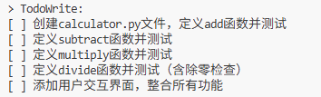
> 实际写入 message 的内容：
> ```python
> {'type': 'tool_result', 
> 'tool_use_id': '019dba151949100fdff2f755f4ec5da0', 
> 'content': 
> 	'[ ] 创建calculator.py文件，定义add函数并测试\n
> 	[ ] 定义subtract函数并测试\n
> 	[ ] 定义multiply函数并测试\n
> 	[ ] 定义divide函数并测试（含除零检查）\n
> 	[ ] 添加用户交互界面，整合所有功能\n\n
> 	(0/5 completed)'}
> ```
> ②针对上面 的tool_use ，assissant 输出：
> ```
> content=[
> ThinkingBlock(signature=None,thinking='好的，todo列表已经创建。现在我开始第一步：创建calculator.py文件，定义add函数并测试。', type='thinking'),  
> TextBlock(citations=None, text='好的！我已经规划好了5个步骤。现在开始第一步：创建加法功能并测试。', type='text'),  
> ToolUseBlock(id='call_0b203b6eeeb64924b98bc183',  
> caller=None,  input={'items': [{'activeForm': '创建add函数', 'content': '创建calculator.py文件，定义add函数并测试', 'status': 'in_progress'}, {'activeForm': '创建subtract函数', 'content': '定义subtract函数并测试', 'status': 'pending'}, {'activeForm': '创建multiply函数', 'content': '定义multiply函数并测试', 'status': 'pending'}, {'activeForm': '创建divide函数', 'content': '定义divide函数并测试（含除零检查）', 'status': 'pending'},{'activeForm': '添加用户界面', 'content': '添加用户交互界面，整合所有功能','status': 'pending'}]},name='TodoWrite', type='tool_use')],
> ```
> 调用工具，重新 render 的效果：
> 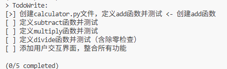
> 后续就是正常的 tool 调用，更新 todo 状态~
> Reminder 作用示例~：
> 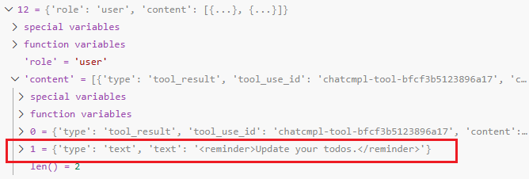
> 
  
  #: 3.2
  Prompt: 接上轮，故意用简单任务让 LLM 不主动更新 todo，连续 3 轮不调用 todo
  预期数据流: 第 3 轮后 results 中出现 <reminder>Update your todos.</reminder>
  关注点: rounds_since_todo >= 3 触发注入，验证 nag 机制
✅
️
  #: 3.3
  Prompt: create 2 tasks and mark both as in_progress simultaneously
  预期数据流: TodoManager.update 抛出 ValueError: Only one task can be in_progress at a time
  关注点: 验证业务约束校验逻辑（s03:73）
✅️
  
  #: 3.4
  Prompt: track my progress: step 1 done, step 2 in progress, step 3 pending
  预期数据流: 观察 TODO.render() 输出的 [x]/[>]/[ ] 标记格式
  关注点: 状态机可视化
✅️

# 功能点 4：Subagent 上下文隔离（s04）
> Process isolation gives context isolation for free.

> [!note] SubAgent
> - 核心思想：**把一个子任务交给一个“全新上下文的小代理”去做，做完只把摘要带回来。**-> 避免中间结果污染上下文
> 	- **fresh context：子代理从空白上下文启动** sub_messages = [{"role": "user", "content": prompt}]
> 	- **shared filesystem：共享文件系统，但不共享思维历史**
> 	- **summary-only return：只把结果摘要传回来**
> 	- **child tools are filtered：子代理的工具是受限的**-> **不能继续无限递归地再生成 subagent**
> 	- **safety limit：有限轮数，防止失控** for _ in range(30):
> - 设计原则："隔离 + 聚焦 + 限权 + 摘要回传“
> 	- **隔离优先，而不是共享优先**
> 	- **让子代理做“边界清晰”的任务**(范围清楚、输出清楚、完成标准清楚)
> 	- **只回传高价值结果，不回传全部过程**
> 	- 限制能力与复杂度
> 	- 一次性，非长期成员
> 		- Subagent：一次性，生成、干活、返回摘要、消亡（轻量）
> 		- Teammate：有身份、有 inbox、能持续协作
> 	- subagent 首先解决的是**上下文污染**问题，其次才是任务拆分问题。
目标：观察父子 Agent 的 messages 隔离，以及 summary-only 返回

  #: 4.1
  Prompt: explore the agents/ directory and give me a summary of all files
  预期数据流: 父 Agent 调用 task(prompt="explore agents/...") → run_subagent
    启动子循环，sub_messages=[] 全新起点 → 子 Agent 读文件 → 返回摘要文本给父
  关注点: 父 messages 只看到 task 的 result，看不到子 Agent 的内部调用过程
> [!note] 
> ```python 
> ToolUseBlock(id='019dba5b9faffe7dde0ed92841564474',  
> caller=None,  
> input={'agent_type': 'Explore', 'prompt': '请探索D:\\Dev\\Projects\\Claude_Learning\\learn-claude-code\\tests目录下的所有内容。请详细检查：\n1. 目录结构和所有文件\n2. 每个文件的内容和用途\n3. 文件之间的关系和依赖\n\n探索完成后，请提供一个详细的summary报告，包括：\n- 目录的整体结构\n- 每个文件的作用\n- 代码的主要功能和特点\n- 任何值得注意的模式或架构'},  
> name='task',  
> type='tool_use')],
> ```
> 下面开始调用：
> 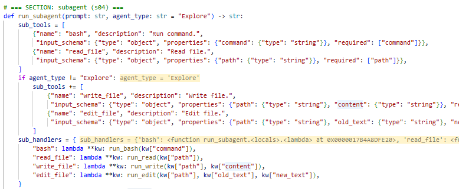
> 子 Agent loop 循环调用，得到的结果中的 textblock 拼接一下，作为 tool result 进行返回即可。
> 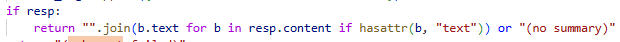


  #: 4.2
  Prompt: 连续问 2 个问题，第 2 个用 task 做
  预期数据流: 观察父 Agent 的 history 列表持续增长，但每次 subagent 是全新的
    sub_messages=[]
  关注点: 验证"子 Agent 不继承对话历史"的核心特性
✅️
  
  #: 4.3
  Prompt: spawn a subagent to do 31 tool calls
  预期数据流: 子 Agent 的 for _ in range(30) 安全上限触发退出
  关注点: s04:120 的 safety limit 保护
  > 安全功能

  ---
# 功能点 5：Context Compaction（s06）
  目标：观察三层压缩管道：micro_compact → auto_compact → manual compact
  
  #: 5.1
  Prompt: 连续执行 5+ 个 bash 命令（如 run: date; pwd; whoami; echo test; ls）
> [!note]micro_compact
> - 每轮都跑，轻量清理旧 tool_result
> - 相关 代码：
> 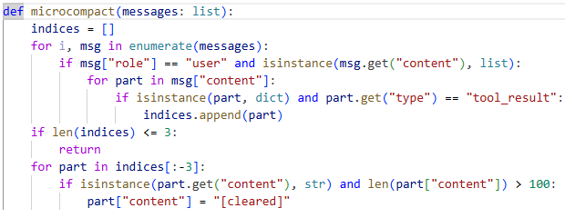
> 针对 `{"type": "tool_result", ...}` 进行处理：
> 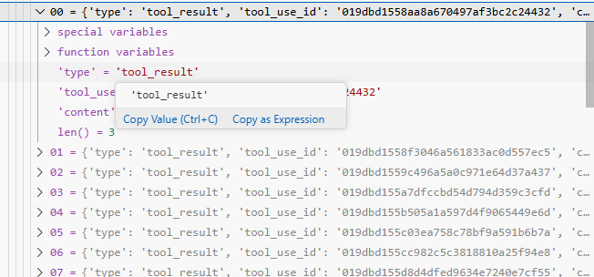


  #: 5.2
  Prompt: 读一个大文件后再执行 bash
  预期数据流: read_file 的结果不被 micro_compact 清除（PRESERVE_RESULT_TOOLS =
    {"read_file"}）
  关注点: 为什么 read_file 被特殊对待：参考资料不该消失
> 可以参考设计思路。

  #: 5.3
  Prompt: 发送非常长的 prompt（粘贴大段代码）触发 tokens > 50000
  预期数据流: [auto_compact triggered] 打印，transcript 保存到.transcripts/，messages被压缩为一条 summary
> [!note]
> 估算方式：
> 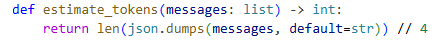
> 超过预设值自动调用 auto_compact:
> 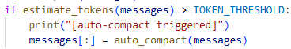
> auto_compact 的代码：
> > ①先做持久化
> > ②再调用模型，压缩历史
> > ③返回原内容的路径 + 历史 overview
> 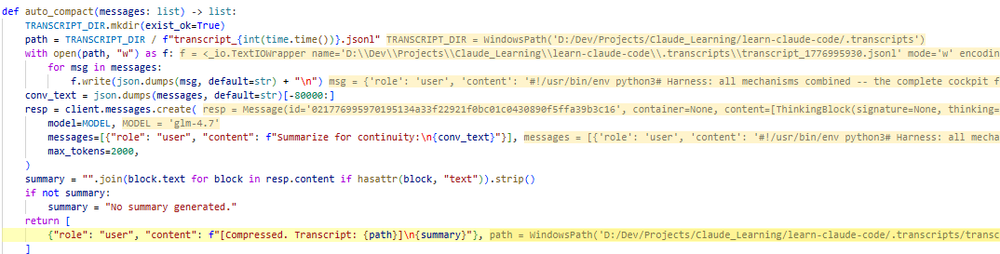


  
  #: 5.4
  Prompt: please compact the conversation now
  预期数据流: LLM 主动调用 compact tool → [manual compact] → auto_compact 立即执行
  > [!note]
  > ```
  > ToolUseBlock(id='call_8fcad2c9b4eb4e82b9591121',  
  > caller=None,  
  > input={'raw_arguments': 'null{}'},  
  > name='compress',  
  > type='tool_use')],
  > ```
  > 这里在设计的时候，并没有把 auto_compress 放在 handler 里面：
  > + “先记下来这轮请求了压缩，等本轮工具执行收尾完成后，再由主循环统一处理。”：避免影响当前的状态
  > + 很典型的“**deferred side effect**”设计：先不要立刻做会影响整体状态的动作，先把当轮结果收集完，等到安全的时机再去统一执行~
  > 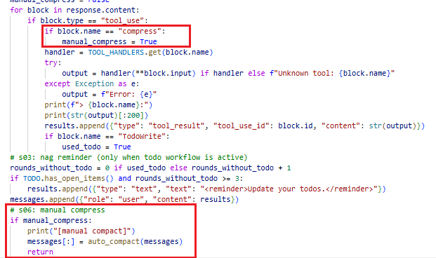
  ---
# 功能点 6：持久化 Task System（s07）
> *Prefer task_create/task_update/task_list for multi-step work. Use TodoWrite for short checklists.*

>  [!note]
>  ```text
> 用户提出复杂目标
>   ->
> 模型决定先拆任务
>   ->
> 调用 task_create / task_update
>   ->
> 任务落到 .tasks/
>   ->
> 后续轮次继续读取并推进
> ```
> **todo 更像本轮计划，task 更像长期工作板。**
>  目标：观察 JSON 文件持久化、依赖图解析
>  - 任务持久化（compact不影响~）
>  - 不是平铺清单，而是依赖图
> 	 - 什么能做：pending 且 blockedBy 为空
> 	- 什么被卡住：blockedBy 不为空
> 	- 什么做完了：status == completed
> - 完成任务会自动解锁后继任务。  
> 	在 agents/s07_task_system.py (line 95) 的 _clear_dependency() 里，只要某任务完成，就会把它的 ID 从别的任务的 blockedBy 中删掉。 像一个轻量 DAG 调度器。


  #: 6.1
  Prompt: create 3 tasks: setup env, write code, run tests
  预期数据流: 3 个 task_N.json 写入 .tasks/ 目录
  关注点: 文件持久化：退出程序后文件仍在，下次启动还能读到
> [!note]
> 调用 task_create:
> 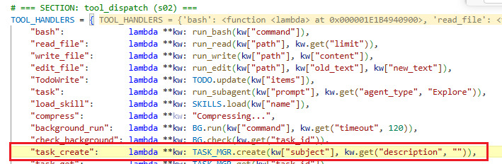
> 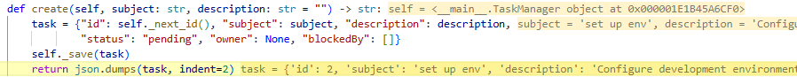
> 工具的输出结果:
> ```bash
> output = '{\n "id": 2,\n "subject": "set up env",\n "description": "Configure development environment including dependencies, configuration files, and project setup",\n "status": "pending",\n "owner": null,\n "blockedBy": []\n}'
> ```
> 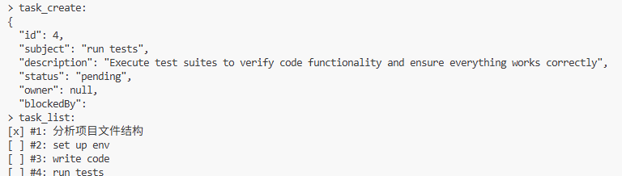
> 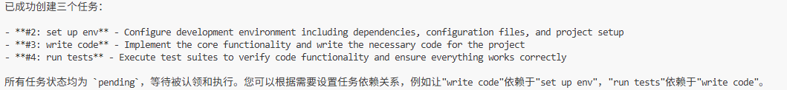
> 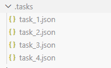


  #: 6.2
  Prompt: make task 4 blocked by task 3, task 3 blocked by task 2
  预期数据流: task_update(addBlockedBy=[1]) → JSON 中 blockedBy 字段更新
  关注点: 依赖图的 add/remove 操作
  > [!note]
  > 调用 Tool：task_update
  > ```
  > ToolUseBlock(id='call_cf06450b4f934ad2ae636962',  
  > caller=None,  
  > input={'task_id': 4, 'add_blocked_by': [3]},  
  > name='task_update',  
  > type='tool_use'),  
  > ToolUseBlock(id='call_6ed33dee54aa4f339b6e3c5b',  
  > caller=None,  
  > input={'task_id': 3, 'add_blocked_by': [2]},  
  > name='task_update',  
  > type='tool_use')],
  > ```
  > Tool handlers:
  > `"task_update":lambda **kw: TASK_MGR.update(kw["task_id"], kw.get("status"), kw.get("add_blocked_by"), kw.get("remove_blocked_by")),`
  > 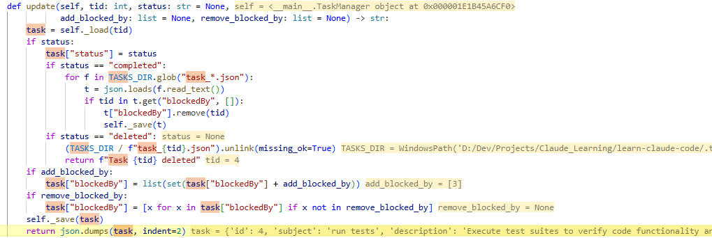
  > 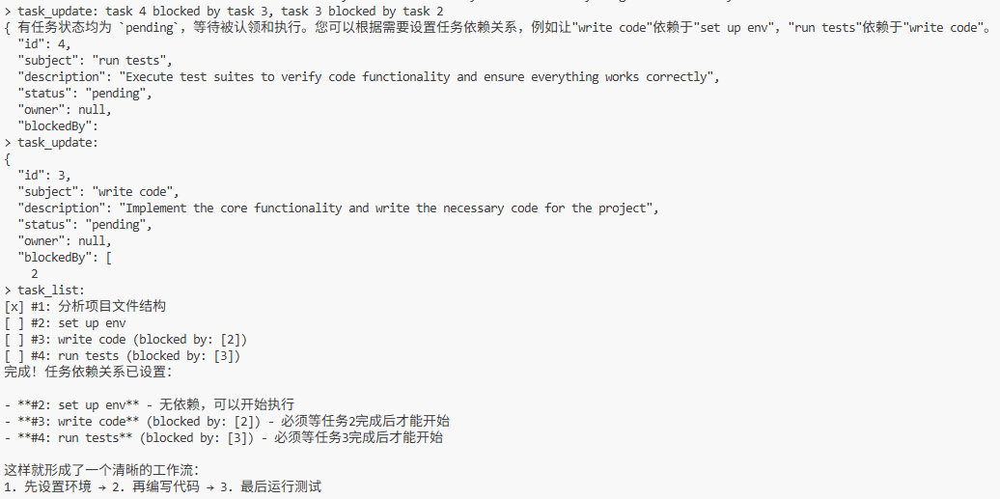
  > json 文件内容：
  > 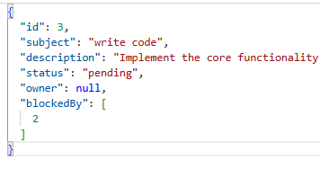

  
  #: 6.3
  Prompt: mark task 2 as completed
  预期数据流:  clear_dependency(1) 被调用 → 扫描所有 task JSON，从 blockedBy 中移除 1
  > [!note]
  > 核心代码（update 里面）：
  >  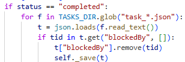
  >  效果：
  > 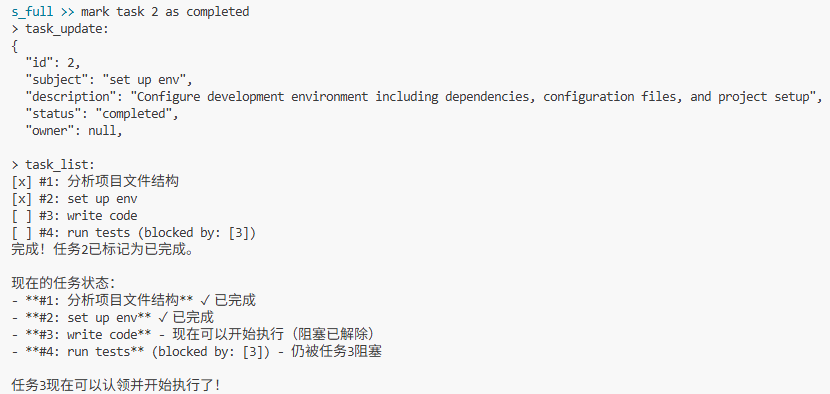

  
  #: 6.4
  Prompt: 运行 task_list 工具
  预期数据流: 输出带 [x]/[>]/[ ] 和 blocked by: [N] 的列表
  关注点: 验证文件系统比 in-memory TodoManager 更持久
✅️

# 功能点 7：Background Tasks（s08）
> [!note]
> 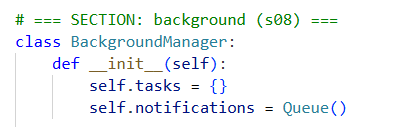
> BG 维护两个数据结构：
> - tasks：完整状态存档，供 check_background 查询
> - notifications：轻量事件流，供注入对话
目标：观察线程并发 + notification queue 的 drain 机制

  #: 7.1
  Prompt: run in background: sleep 3 && echo done
  预期数据流: 立即返回 task_id，3 秒后下次 LLM 调用前 drain_notifications() 得到结果
  关注点: 主线程不阻塞；notification 在 agent_loop:192 注入
> 调用工具：
> ```
> block = ToolUseBlock(id='019dbd5d67d2b84dcf4dda6eb04e07c5',  
> caller=None,  
> input={'command': 'sleep 3 && echo done'},  
> name='background_run',  
> type='tool_use')
> ```
> 
> **run():**
> - 生成 task id
> - 任务登记为 running
> - 启动一个 daemon=True 的线程
> 	- daemon thread 的意思是：主程序退出时，这些线程不会强行把进程留住。
> - 不等任务执行结束，就直接返回结果。
> - 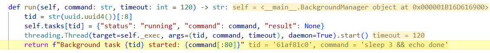
> 执行完后，把结果放到 notification 队列：
> - get_nowait() 的意思就是：
> 	- 如果有元素，马上拿出来
> 	- 不阻塞当前线程去等新元素
> 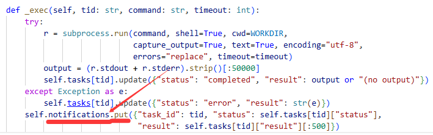
> 通过 BG.drain()拿到刚才 background 的内容
> 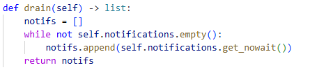
>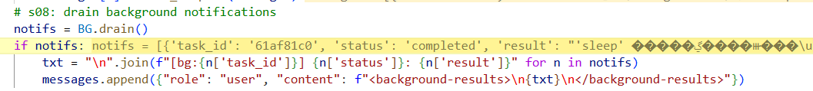
  
  #: 7.2
  Prompt: start 3 background tasks simultaneously
  预期数据流: 3 个线程并发运行，BackgroundManager.tasks dict 中 3 条记录
  关注点: 验证 threading.Lock 的作用：多线程同时写 notification_queue
> 多进程写 notification 的时候，采用了 Queue：
> 	Queue 是 Python 标准库里的线程安全队列，已经内建同步机制，所以多个后台线程同时 put() 不会把队列写坏，也不会互相覆盖。
> 	**多个后台线程同时完成时，共享的任务表和通知队列是否仍然一致、完整、不会丢消息。**
> - task dict 没上锁是因为，每次操作前必须要拿到唯一 tid 对应修改
> - drain notification 也是基本安全：
> 	- 只有主线程会消费这个队列
> 	- 后台线程只负责 put
> 	- 就算某条通知恰好在 empty() 之后才进来，也只是“这一轮没 drain 到”，下一轮还会被 drain 出来
> 	- 不会把队列写坏，也不会丢结构


  #: 7.3
  Prompt: check background task <task_id>
  预期数据流: BG.check(task_id) 返回 [running/completed] + result
  关注点: 状态转换：running → completed
  > 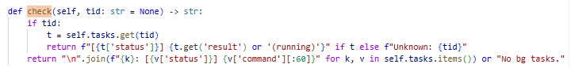
  > 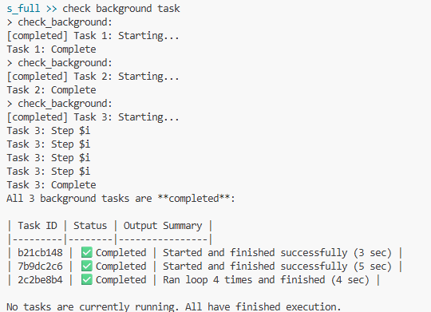

  #: 7.4
  Prompt: run background: some_command_that_takes_400s
  预期数据流: 5 分钟后 task status 变 timeout，结果为 Error: Timeout (300s)
  关注点: s08:76 的 timeout 捕获
> √
# 功能点 8：Agent Teams（s09）
> ## agent team 通信机制
> **先把这个队友收件箱里的新消息取出来，再把这些消息注入到它自己的对话上下文里。**
> 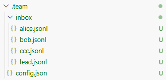
> ```python
> inbox = BUS.read_inbox(name)
> for msg in inbox:
>     messages.append({"role": "user", "content": json.dumps(msg)})
> ```
> - BUS.read_inbox(name)会将- .team/inbox/name.jsonl 信箱的内容取出来并清空~
> - 然后把站内信转换成上下文消息，让模型在下一次推理时看见它。
> 
  目标：观察多 Agent 通过 JSONL inbox 文件通信

  #: 8.1
  Prompt: spawn a teammate named alice with role "code reviewer"
  预期数据流: TEAM.spawn("alice","code reviewer", prompt) → 新线程启动 →.team/config.json 写入 alice 记录
  关注点: 每个 teammate 是独立线程，有自己的 messages 列表
  > [!note]
  > 调用工具：
  > 
  > 具体实现：
  > 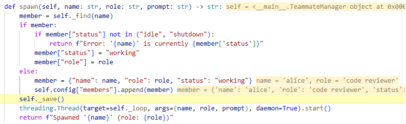
  > - **. 先看这个人是不是已经在团队里**
  > - **如果已经存在，先看状态能不能重新启动**（仅对 idle、shutdown 状态的队员重启~）
  > - **如果不存在，就新建一个成员记录**
  > - **最后启动一个线程去跑这个 teammate 的 agent loop**
  > 下面看一下 teammate loop 里面的内容：
  > - user：初始的 prompt 输入，定义好角色
  > - ass：调用工具给团队发消息~ToolUseBlock(id='call_bcc5af598056428cb4c24489', caller=None, input={**'to': 'team',** 'content': "Hello team! Alice here, ready to review code. Please share any pull requests, code changes, or files you'd like me to examine. I'll focus on correctness, security, performance, maintainability, and ensuring code follows best practices."}, name='***send_message***', type='tool_use')
  > 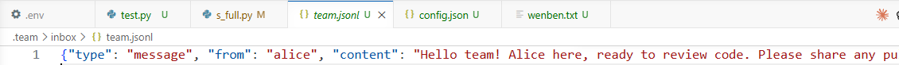
  > - user：工具返回结果
  > - ass：{'role': 'assistant', 'content': [ThinkingBlock(signature=None, thinking="Good, I've introduced myself and let the team...g for tasks to work on.", type='thinking'), ToolUseBlock(id='019dbd82fdc29db86eb0e462737011da', caller=None, input={}, name='**idle**', type='tool_use')]}休眠
  > 
  > 休眠实现的逻辑：
  > 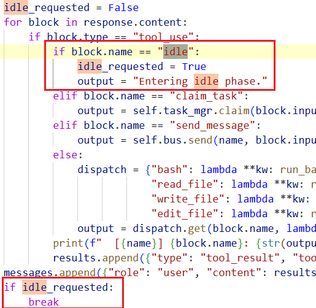
  
  #: 8.2
  Prompt: send alice a message: please review agents/s01_agent_loop.py
  预期数据流: BUS.send("lead","alice","...") → .team/inbox/alice.jsonl 追加一行 JSON
  关注点: 文件即消息队列：JSONL 格式，append-only
  > 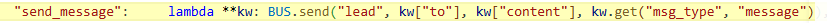
  > 持久化写到对应的信箱📪 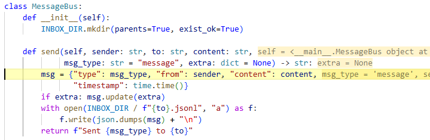
  > 
  > msg = {'type': 'message', 'from': 'lead', 'content': '请review一下agents/s_01_agent_loop.py的代码', 'timestamp': 1777002217.3066719}
  > alice 的 inbox（.team/inbox/alice.jsonl）:
  > 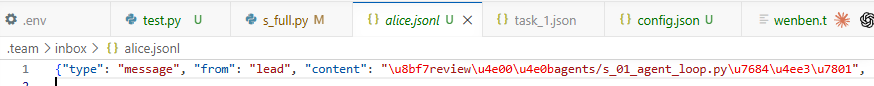
  > alice 之后会读取 inbox 拿到这条消息，添加如上下文，执行 review，再通过工具调用 send to lead
  > 返回核心结果给 主 Loop。

  #: 8.3
  Prompt: /inbox（内置命令）
  预期数据流: BUS.read_inbox("lead") 读取 .team/inbox/lead.jsonl 并清空
  关注点: Drain 语义：读完即清，不能重复读
✅️
  
  #: 8.4
  Prompt: broadcast: all hands meeting in 5 minutes
  预期数据流: BUS.broadcast 向所有 teammates 各写一条 broadcast 类型消息
  关注点: 验证消息类型枚举：VALID_MSG_TYPES 过滤无效类型
>  ToolUseBlock(id='call_025d1f7fd16b41129130a444', caller=None, input={'content': '📢 All hands meeting in 5 minutes! Please be ready.'}, name='**broadcast**', type='tool_use')
>   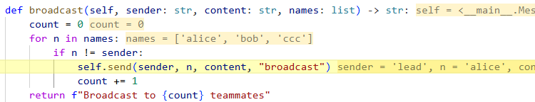
  
  #: 8.5
  Prompt: /team（内置命令）
  预期数据流: 显示 config.json 中所有成员的 name/role/status
  关注点: Alice 从 working 变为 idle 的时机
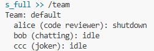

# 功能点 9：Skill Loading
> 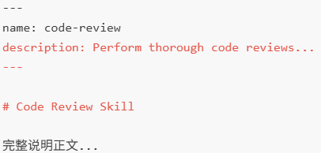
> ①将 your-skill 放在 skills 目录下，在创建 sys_prompt 的时候会去扫描那个目录下的 skills 信息：
> 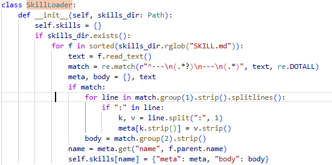 通过 frontmatter 拆分成 meta 和 body 两部分，注册成下面的格式：
> ```python
> self.skills[name] = {
>     "meta": meta,
>     "body": body,
>     "path": str(f),
> }
> ```
> ②通过 descriptions 方法拼进 system prompt：
> 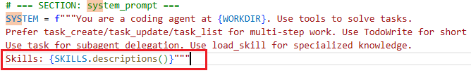
> description 的实现如下：
> 拼接成 `f"  - {name}: {desc}"` 这样的形式。这下模型就知道有哪些“最新”的 skill 可以用了
> ③运行时如何触发？-> 注册了一个 tool 供模型调用 
> ```python
> TOOL_HANDLERS = {
>     ...
>     "load_skill": lambda **kw: SKILL_LOADER.get_content(kw["name"]),
> }
> ```
> 调用就是返回 skill 的 body：
> 
> `return f"<skill name=\"{name}\">\n{skill['body']}\n</skill>"`
> agent loop 会把这个结果作为 tool_result 加进 messages。后续模型就会基于 该 skill 完成 task
> 总结一下 Skill 的特点：
> - 轻量、可扩展~
> - 只在 skill 启动的时候进行扫描~
> - 同名 skill 会覆盖~

Prompt
1. What skills are available?
2. Load the code-review skill first, then review quicksort.py.
> ```
> ToolUseBlock(id='call_00_N6P1oAepTj5i6XCpK2tMdKNf',  
> caller=None,  
> input={'name': 'code-review'},  
> name='load_skill',  
> type='tool_use'),  
> ToolUseBlock(id='call_01_hFzviVGyOfUMerx7JLxlmdgA',  
> caller=None,  
> input={'path': 'D:\\Dev\\Projects\\Claude_Learning\\learn-claude-code\\agents\\quicksort.py'},  
> name='read_file',  
> type='tool_use')],
> ```
> 
> `output = '<skill name="code-review">\n# Code Review Skill\n\nYou now have expertise in conducting comprehensive code reviews.............. </skill>' `
3. Load the agent-builder skill and use it to outline a minimal agent.
4. Try loading a non-existent skill named foo.（未知 skill返回 Error: Unknown skill ...。）
✅️
预期数据流  
启动 -> SkillLoader 扫描 skills//SKILL.md -> SYSTEM 只注入技能名/描述（Layer 1） -> 模型在需要时调用 load_skill(name) -> TOOL_HANDLERS["load_skill"] -> 返回 skill name="..."完整正文（Layer 2） -> 模型继续 read_file / write_file / edit_file

关注点
- 第 2/3 个 prompt 应出现 load_skill 工具调用，返回体里能看到 skill name="..."。

# 功能点 10：Team Protocols
Prompt
1. Spawn alice as a coder. Then request her shutdown.
>  调用 spawn 工具，激活 alice 状态：
 
> 调用 handle_shutdown_request 工具，投入📪：
> 
> alice 取出📪内容：进入 shutdown 状态
> 
> 
> 注意这里设置完 shutdown 状态后，通过 return 退出_loop 函数结束该线程。
2. Check the shutdown request status and list teammates.
3. Spawn bob as a coder. Tell him not to edit files until he submits a plan for approval. When the request arrives, reject it with feedback: "too risky, split it first".
> [!note]
> bob 向 lead 发出请求内容：
> 
> 通过 inbox 块加入到 lead 上下文中！
> ```python
> if inbox:
>       messages.append({"role": "user", "content": f"<inbox>{json.dumps(inbox, indent=2)}</inbox>"})
> ```
> 
4. Spawn charlie as a coder. Tell him to submit a short plan before acting, then approve it.
✅️
预期数据流 （s 10 版本，在 s_full 中已经被简化了）
①lead 向 teammate 发起关机请求：
```
lead tool: shutdown_request
  -> 生成 req_id
  -> 写 shutdown_requests[req_id] = pending
  -> 写 alice inbox: shutdown_request

alice read_inbox
  -> JSON 消息进入 alice 上下文
  -> alice 调 shutdown_response

teammate tool: shutdown_response
  -> 更新 shutdown_requests[req_id] = approved/rejected
  -> 写 lead inbox: shutdown_response
  -> approve=true 时退出线程
```
②teammate 向 lead 发起 plan 的请求：
```
alice tool: plan_approval
  -> 生成 req_id
  -> 写 plan_requests[req_id] = pending
  -> 写 lead inbox: plan text + req_id

lead read_inbox
  -> plan 消息进入 lead 上下文
  -> lead 调 plan_approval(request_id, approve, feedback)

leader tool: plan_approval
  -> 查 plan_requests[request_id]
  -> 更新 approved/rejected
  -> 用 req["from"] 发回 alice inbox

alice read_inbox
  -> 收到审批结果
  -> 决定继续、修改计划或停止
```
③面对多个 plan 批准请求的时候：
```
plan_requests = {
  "aaa11111": {
    "from": "alice",
    "plan": "Plan A",
    "status": "pending"
  },
  "bbb22222": {
    "from": "alice",
    "plan": "Plan B",
    "status": "pending"
  },
  "ccc33333": {
    "from": "bob",
    "plan": "Plan C",
    "status": "pending"
  }
}
```
lead 根据不同的 id 审批不同的结果，根据请求发送人'from'发回去~


关注点
- request_id 是这章最核心的相关键，发起和响应必须一致。
- plan approval 在代码里是“协议约束 + 提示词约束”，不是硬阻塞事务；也就是 teammate 是否真的等审批，部分取决于模型是否遵守协议。

# 功能点 11：Autonomous Agents
> ①Autonomous 流程：
> spawn teammate
>   -> WORK: 执行当前任务
>   -> IDLE: 空闲时轮询 inbox 和 .tasks
>   -> 如果有消息，resume = True 
>   -> 如果有未领取任务，自动 claim 申领任务（带锁~）resume = True
>   
>   -> 根据 resume 的 bool 值判断
> 	  如果 60 秒都没事（resume = False），shutdown
> 	  如果 resume == true -> 重新进入"working"状态~
>   
>   ②在 teammate loop 中，是有两阶段：work 和 idle（顺序，工作处理完，就变成 idle~）

Prompt
1. Create 3 tasks on the board, then spawn alice and bob. Watch them auto-claim
> alice 和 bob 同时 查看了 task 1 的内容，alice 先 claim 了（_claim_lock 避免两人抢到同一个任务）


2. Spawn a coder teammate and let it find work from the task board itself.
3. Create tasks with dependencies. Watch teammates respect the blocked order.
4. Let an idle teammate sit with no messages or tasks for 60 seconds, then list teammates.

预期数据流：
task_create -> .tasks/task*.json status=pending -> spawn_teammate -> WORK phase -> teammate 调用 idle 或 stop_reason != tool_use -> 状态切到 idle -> 每 5 秒轮询 inbox + scan_unclaimed_tasks() -> 命中可认领任务后 claim_task() 加锁写回 owner/status=in_progress -> 注入 auto-claimedTask #... -> **teammate 恢复 working** -> 若 60 秒内无消息也无任务则自动 shutdown

关注点
- 可自动认领的任务必须同时满足：pending、owner 为空、blockedBy 为空。
- 这是异步行为，观测时要留一点时间给轮询周期。
- 重点看 .tasks/ 中任务的 owner/status 变化，以及 .team/config.json 中 teammate 的 working/idle/shutdown 变化。
- 这一章还有“身份重注入”机制：当上下文很短或压缩后恢复工作（len(msg) <= 3），会插入 identity...；这是内部韧性点，黑盒上不一定直观看到，但值得留意。

# 功能点 12：Worktree + Task Isolation  

> **背景**：agent/teammate 已经能自主领取任务了，但所有任务还在同一个目录里改代码。多个任务并行时，很容易互相污染。
>> 如果都在主目录干活，就会出现：
>> - 未提交改动混在一起。
>> - 很难知道哪个任务改了哪些文件。
>> - 一个任务失败时不好回滚。
>> - 两个 teammate 并行改同一目录，容易互相踩。
>> - review / test / cleanup 都不清晰。
> 解决思路：
>> 任务板管“做什么”
>> git worktree 管“在哪里做”
>> 二者用 task_id 绑定
> 典型工作路径：
> ```
> task_create
>   -> 写 .tasks/task_1.json
> 
> worktree_create(name, task_id=1)
>   -> git worktree add
>   -> 写 .worktrees/index.json
>   -> 更新 task_1.json: worktree=name, status=in_progress
>   -> 写 events.jsonl
> 
> worktree_run(name, command)
>   -> cwd=.worktrees/name 执行命令
> 
> worktree_remove(name, complete_task=True)
>   -> git worktree remove
>   -> task_1.json status=completed, worktree=""
>   -> index.json status=removed
>   -> 写 events.jsonl
> ```
>


Prompt
1. Create tasks for backend auth and frontend login page, then list tasks.

2. Create worktree "auth-refactor" for task 1, then create worktree "ui-login" for task 2.

3. Run "git status --short --branch" in worktree "auth-refactor".

4. Keep worktree "ui-login", then list worktrees and inspect events.
5. Remove worktree "auth-refactor" with complete_task=true, then list tasks, worktrees, and events.


预期数据流  
task_create -> .tasks/task_N.json status=pending -> worktree_create(name, task_id) -> git worktree add -b wt/name .worktrees/name HEAD -> .worktrees/index.json 追加 entry -> TASKS.bind_worktree() 写回 task.worktree 并把 pending 推到 in_progress -> worktree_run 在 .worktrees/name 下执行命令 -> worktree_keep 或 worktree_remove -> EventBus 写入 .worktrees/events.jsonl -> 若 complete_task=true，则任务状态置 completed 并解绑 worktree

关注点
- 这章必须在 git 仓库里测，否则 worktree_* 会直接报错。
- worktree_remove 在目录有未提交改动时可能失败，必要时才测 force=true。
- 核心验证对象不是聊天文本，而是三份持久化状态：.tasks/、.worktrees/index.json、.worktrees/events.jsonl。

# 实测下来的感受
- 可扩展性好（tools、skill、teammate）
- 在 agent team 那边可能还有点 bug
	- ①直接中断退出，teammate 会出现假 working 的情况（在 config 中）√已修
	- ②lead 直接给 teammate 发消息的时候，不会确认 teammate 线程在线直接发送消息，这样就会消息不会进入子 loop（出现没人回复的情况）->改一下 prompt 调用 tool 的逻辑，先 check 队员状态，不在的通过 spwan 激活。
- team protocol 在 s_full.py 里面是不太全，teammate 并没有 track 不同 request_id~可以用 s_10 进行测试。
- 自治的 teammate agent 暂时不支持根据个人 role 与 task 的相关性 claim 任务。