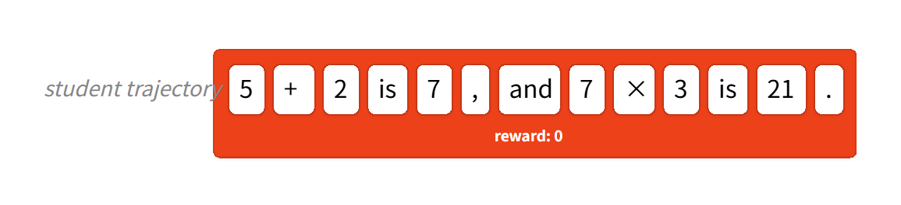
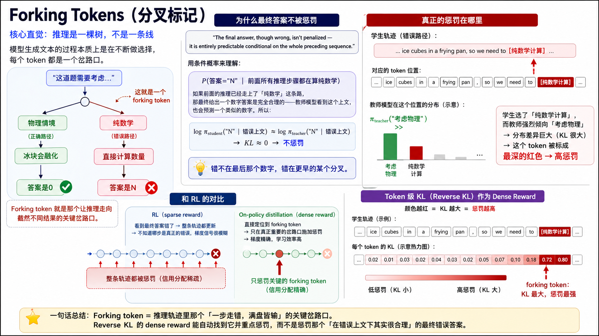
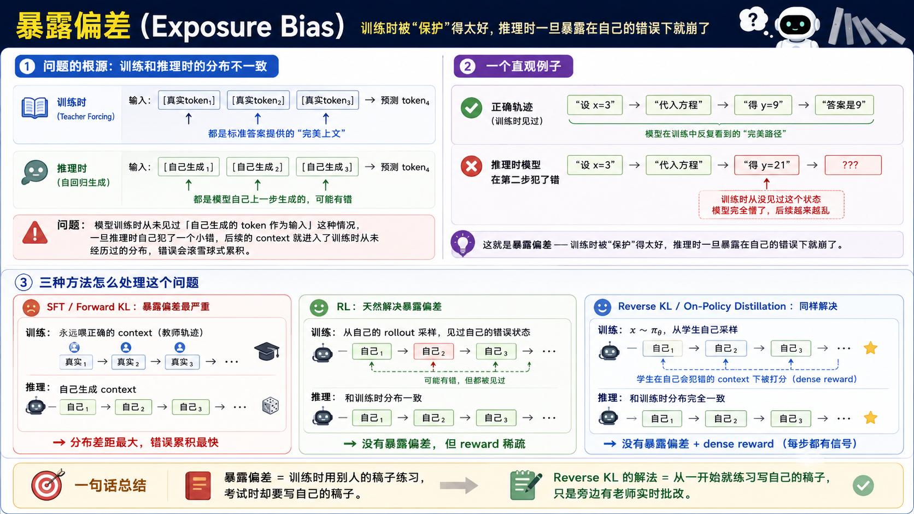

> 本文是我对 On-Policy Distillation（OPD）的一份综述笔记，覆盖从分布视角的理论框架到 Thinking Machines 的实验结果，再到 THUNLP 的失败机制分析，最后落到 tinker-cookbook 的核心实现代码。
>
> 关于 OPD 本身的数学推导（信息论 → reverse KL → per-token dense reward 的完整六步代数变形），单独写在另一篇 [从信息论到 On-Policy Distillation：一次完整的推导](../opd-derivation/) 里，本文不展开。

## 0. 参考资料与代码来源

本节列出本文涉及的核心来源，便于回溯原始论证。

> 参考博客：
> - https://thinkingmachines.ai/blog/on-policy-distillation/
> - https://nrehiew.github.io/blog/sft_rl_opd/ — *SFT, RL, and On-Policy Distillation Through a Distributional Lens*（nrehiew_，对应推文 https://x.com/nrehiew_/status/2053482349300797526 ）
>
> 实现代码：
> - https://github.com/thinking-machines-lab/tinker-cookbook/tree/main/tinker_cookbook/recipes/distillation
>
> 深度机制分析（THUNLP）：
> - https://arxiv.org/abs/2604.13016 — *Rethinking On-Policy Distillation of Large Language Models*

## 1. 背景：后训练方法本质上是在调整模型分布

本节先建立一个统一视角——SFT、RL、OPD 都可以放在"调整模型条件概率分布"的同一框架里讨论。

LLM 的训练方法可以划分为三大阶段：①pretrain ②mid-train（通常是领域知识） ③post-train。

LLM 本质上是一个**条件概率分布**：给定 prompt $x$，输出对所有可能 response $y$ 的概率分布
$$
\pi_\theta(y \mid x)=\prod_{t=1}^{T}\pi_\theta(y_t \mid x,y_{<t})
$$
所以无论是 SFT、RL 还是 OPD，本质上都是在**调整预训练模型的概率分布**。

后训练方法可分为两类：



- **Off-policy training**：依赖来自外部来源的目标输出，智能体通过模仿这些输出来学习，通常即 SFT
- **On-policy training**：从学生模型本身采样展开轨迹，并为其分配奖励
	- 优势：基于自身生成的样本来训练，更直接地学会避免错误
	- 缺陷：反馈稀疏（虽然知道整个轨迹错了，但无法定位错在哪一步——运算顺序错了还是算术本身错了，效率较低）

以下表格把三种方法的"数据来源 / 奖励密度 / 信息量"放在一起对比，便于建立总体印象：

| 方法 | 训练数据来源 | 是否 on-policy | 奖励密度 | 信息量 |
| --- | --- | --- | --- | --- |
| **SFT / Off-policy Distillation** | 人工标注 / 教师生成 | 否 | Dense | O(N) bits，但分布错位 |
| **RL** | 策略模型自身 rollout | 是 | Sparse | O(1) bits per episode |
| **On-policy Distillation** | 学生模型自身 rollout | 是 | Dense | O(N) bits，分布对齐 |

一句话概括：

> ***On-policy Distillation* = RL 的 on-policy 相关性 + Distillation 的 dense reward**，两者优点兼得。

## 2. 三种后训练范式的核心差异

本节从分布层面比较三种方法对模型分布的改造方式。决定模型是否容易**灾难性遗忘**、泛化能力是否更好的关键，不只是"有没有老师"，而是**模型是不是在自己的分布上学习**。

### 2.1 SFT / Off-policy Distillation：外部分布强制对齐

SFT 最小化交叉熵损失，等价于最小化前向 KL：
$$
H(p,q)=H(p)+D_{KL}(p\parallel q)
$$
真实数据分布 $p$ 固定，所以最小化交叉熵 ≡ 最小化 $D_{KL}(p\parallel q)$。其含义是：外部数据分布是什么样，模型就被强制往哪里拉；如果训练数据与原始模型分布差距较大，原本的分布会被大幅改写。

**灾难性遗忘机制（以"通用模型 → 垂直领域"为例）：**

- 垂直领域里有很多领域特有 token（专业术语、代码、特殊表达等）
- 这些 token 原本不在通用模型的高概率区域里
- 交叉熵会强制把模型分布往这些 token 所在区域拉过去
- 结果是模型原本的通用知识分布被显著扰动 → 通用任务表现下降

**常见缓解方式：** 训练时混入一部分通用数据，让训练分布不要离原模型分布太远，但本质上仍然是外部分布对齐。

**更深一层的问题：SFT 缺少 token 重要性区分（nrehiew）**

SFT 的交叉熵对所有 token 施加**均匀且激进的 token-level 梯度**——没有机制区分**任务关键 token**（数学结论、代码语义）与**无关 token**（连接词、格式 token）。

再叠加自回归生成中的**累积误差问题**（compounding errors，Ross 等 DAgger 论文）：学生只在教师走过的状态上被监督，一旦推理时与教师分布发生偏差，误差沿轨迹累积放大；SFT 无法暴露学生于其自身的错误状态，这是 SFT 泛化差的核心根源。

**SFT 仍然不可替代的场景：** 冷启动（cold start）、输出格式对齐、风格 / 模板约束、RL 之前的初始化阶段。

### 2.2 RL：在自身分布上做局部重塑

RL 不去拟合外部分布，而是在当前模型自己的分布上采样，通过 reward 告诉模型哪些 token / 轨迹更好：
$$
J(\theta)=\mathbb{E}_{y\sim \pi_\theta(\cdot\mid x)}[r(x,y)]
\qquad
\nabla J(\theta)=\mathbb{E}_{y\sim \pi_\theta}[A(x,y)\nabla \log \pi_\theta(y\mid x)]
$$
关键特征：

- response 是模型自己生成的 → 这些 token 都是模型"能到达"的区域
- reward 只是告诉模型：哪些该升，哪些该降
- 更新发生在**当前策略附近**

RL 主要在调整：已经有一定概率的区域、模型自己能访问到的区域、与当前策略最接近的那一批更优解。它不像 SFT 那样去全面逼近一个陌生分布，因此更不容易造成大范围分布漂移与遗忘。

### 2.3 OPD：在学生自身轨迹上接受教师 dense 监督

OPD 介于 SFT 和 RL 之间：

- **像 SFT**：有教师模型提供 dense 监督信号
- **像 RL**：用的是学生模型自己 rollout 的轨迹

OPD 最小化学生与教师之间的 reverse KL：
$$
D_{KL}(\pi_s \parallel \pi_T)
=
\mathbb{E}_{y\sim \pi_s}\left[\log \pi_s(y\mid x)-\log \pi_T(y\mid x)\right]
$$
等价于最大化：
$$
\mathbb{E}_{y\sim \pi_s}\left[\log \pi_T(y\mid x)-\log \pi_s(y\mid x)\right]
$$
可以理解为：

- $\log \pi_T(y\mid x)$ ≈ **dense reward**
- $-\log \pi_s(y\mid x)$ ≈ **KL / entropy 风格约束项**

所以 OPD 很像"有老师逐 token 打分的 RL"。这一对应关系的完整六步代数推导，写在另一篇 [从信息论到 On-Policy Distillation：一次完整的推导](../opd-derivation/) 里。

### 2.4 一句话类比：SFT、RL、OPD 的区别

为方便记忆，可以用三句口语化的类比把三者钉在脑子里：

- **SFT**：别人给答案，我照着学（外部分布强拉齐 → "整体搬家"）
- **RL**：我自己做题，奖励告诉我大方向（自身分布局部重塑 → "局部调参"）
- **OPD**：我自己做题，老师对我的每一步细粒度讲评（自身分布 + dense 指导 → "原地练习 + 高密度指导"）

OPD 最值得记住的点不是"有老师"，而是：

> **老师是在学生自己走出来的轨迹上打分，而不是拿一份外部标准答案强行灌给学生。**

这正是它与普通 SFT 的本质区别。

## 3. OPD 的核心机制

本节把 OPD 从"概念"推进到"机制"——从 reverse KL 的性质、forking token 的精确惩罚，到为什么它能抗遗忘、为什么和 continual learning 是天作之合。

### 3.1 Reverse KL 与 dense reward

OPD 使用的 reverse KL 目标在性质上恰好契合"on-policy 蒸馏"的需求，主要有三大优势：

- **Mode-seeking**：学生聚焦于教师的某一种好策略，不会分散到多个次优解
- **减少 exposure bias**：从学生自身采样，训练和推理分布一致
- **不可 hack**：KL 为 0 严格对应教师行为，没有 reward hacking 的可能


### 3.2 Forking Token 的精确惩罚

教师始终在**学生实际走过的上文**下打分，因此惩罚的强度天然地随着"错误是否真的发生"而变化：

```
forking token 处：学生走偏 → 教师分布差异最大 → KL 最大 → 强惩罚
forking token 后：上文已错但自洽 → KL ≈ 0 → 几乎不惩罚
最终错误答案：条件于错误上文完全合理 → 不惩罚
```

梯度自动集中到真正的错误发生点，而非整条轨迹。

### 3.3 为什么 OPD 比普通 SFT 更抗遗忘

OPD 抗遗忘的根源并不在于"有老师"，而在于**学生是在自己的分布上学习**。把 2.1–2.3 的分布层面分析合到一起看，对比就很清楚：

- **SFT**：外部分布强行拉齐 → 模型原本的概率分布被全面改写 → 大范围分布漂移，灾难性遗忘易发生
- **OPD**：学生只在自己能到达的分布上接受监督 → 更新被天然约束在可达分布内 → 不容易触碰原本无关的知识区域

**更深一层的机制：on-policy 数据本身就是隐式正则化（nrehiew）**

nrehiew 进一步指出：on-policy 训练**隐式地选择"最接近当前模型的任务解决策略"**。这意味着更新被天然约束在模型已经访问的分布内，**不需要显式 KL 惩罚就具备抗遗忘的内建正则化**。

> 强证据：即使 RL 移除显式 KL 惩罚，依然保持抗遗忘特性——这说明 OPD/RL 的抗遗忘**主要来自数据分布本身**，而不是来自显式的 KL 项。

这把"on-policy 才是关键"这一结论，从经验观察上升为机制解释。

### 3.4 OPD 与 Continual Learning 的关系

OPD 在持续学习场景中的优势同样来自上面的"on-policy 即隐式正则化"机制。

即便用模型自身样本做 SFT（KL=0 数据集），任何大于 0 的学习率都会导致性能退化。原因：有限 batch 导致实际分布偏移，SFT 随时间演变成 off-policy 训练。

> **On-policy distillation 的教师固定，学生始终收敛到教师行为，不会出现这种退化**。

这一性质让 OPD 天然适合"学新知识但不丢老能力"的 continual learning 范式（详见 §5.4）。

## 4. 实验结果与现象总结

本节按"先看效果，再看现象"的顺序汇总 Thinking Machines 博客中的实验。每个实验只回答一个具体问题。

### 4.1 数学推理实验：AIME'24

**设置：** Qwen 3-8 B-Base 上，先用 OpenThoughts-3 做 SFT 400 K prompts（达到 60%），再对比三种 post-training。

|方法|AIME'24|计算量（相对）|
|---|---|---|
|SFT 继续扩展到 2 M（推测）|~70%|1×|
|RL（Qwen 3 官方，17920 GPU hours）|67.6%|≈1×|
|**On-policy Distillation（本文）**|**70%**|**9-30×** 更省|

- 150 步（约 77 K prompts）达到 70%，RL 需要约等量计算才到 68%
- 计算量节省 9 x（有现成数据集）到 30 x（需从头生成数据集）
- LoRA 在 SFT 阶段落后 full FT 13%，但 on-policy distillation 后差距缩小到 6%

### 4.2 Self-distillation 效率对比

**设置：** 从 Qwen 3-8 B-Base 出发，先跑 RL 得到一个好的教师，再用 on-policy distillation 把这个策略蒸馏回基础模型。

```
On-policy distillation：10 步内 KL → 0，AIME 恢复教师水平
RL：需要 70 步达到同等水平

综合计算量节省：50-100x
原因：
  ① 可以用更短的上下文训练（无需等到完整 rollout 结束）
  ② 强 SFT 初始化下 batch size 可以极小
```

### 4.3 单题多轮训练的数据效率现象

**设置：** 只用 1 道题，训练 20 步，每步 256 个 rollout。

```
结论：单题多轮训练足以复现教师在 AIME'24 的完整性能
原因：reverse KL 学的是分布，不是记忆答案
     → RL 在同样设定下会过拟合于记住答案
```

但注意：右图 KL 最低 ≠ 左图准确率最高，KL 趋近 0 是过拟合信号。

### 4.4 个性化内部助手与持续学习

**设置：** Qwen 3-8 B 在内部文档上做 mid-training，观察 IF-eval（指令遵循）的退化与恢复。

|阶段|内部 QA（知识）|IF-eval（指令）|
|---|---|---|
|原始 Qwen 3-8 B|18%|85%|
|+ midtrain 100% doc|43%|45%|
|+ midtrain 70% doc|36%|79%|
|**+ midtrain (70%) + distill**|**41%**|**83%**|

- 任何比例的 mid-training 都会破坏 IF-eval，LoRA 也无法避免
- On-policy distillation 用早期 checkpoint 作为教师，几乎完全恢复指令遵循能力
- 知识和 chat 能力之间还有正向迁移

### 4.5 教师质量与 OPD 学生表现

**设置（最小代码编辑）：** 构造两个教师模型——

1. **SFT 得到的教师**：原有能力下降明显、泛化较差
2. **RL 得到的教师**：基本保持原有能力、泛化更强

然后分别用这两个教师，通过 OPD 训练学生模型。

**现象：** 两个学生模型最终表现非常接近，且都明显优于那个 SFT 教师本身。

**启发：** 教师模型本身是不是"完美分布"没有那么重要，真正重要的是学生是否在**自己的分布上学习**。也就是说，**on-policy 性质本身**就是 OPD 有效的关键原因之一。

### 4.6 学生为什么可能超越教师（nrehiew）

实验中（包括 §4.5）OPD 学生有时不仅匹配甚至**超越**教师本身，两个机制共同作用：

**机制一：学生的 on-policy 状态分布修正了教师无法覆盖的盲区**

学生与教师犯**不同的错误**（参考 Ross 等的 DAgger 分布不匹配理论）。OPD 让教师在**学生实际走到的状态**上提供监督，恰好补足了教师轨迹无法覆盖的"学生错误状态"——这是 SFT 模仿学习根本做不到的。

**机制二：KL 匹配 ≠ Reward 最大化**

教师分布不仅编码"最优 token"，还编码**风格、不确定性、推理结构**等富信息。学生通过 reverse KL 学到的是**完整分布**，比"贪心模仿教师最优答案"传递了更多有用信号——这正是为什么学生能在分布层面优于教师。

## 5. 核心 Insights

本节把 Thinking Machines 博客与 nrehiew 长文中的关键论点抽出来，重排成 7 条可记忆的洞察。

### 5.1 Dense reward 的信息论优势

RL 每个 episode 只传递 O(1) bits，distillation 传递 O(N) bits（N 为 token 数）。这不是工程优化，是信息论层面的根本差异，决定了收敛速度的数量级差距。

### 5.2 RL 找策略，Distillation 传策略

RL 大部分计算花在**搜索**（rollout + credit assignment）而非梯度更新。一旦 RL 找到好策略，distillation 是把这个策略传递给另一个模型的捷径——不需要重演 RL 课程中所有中间策略，只需直接学最终策略。类比：科研发现需要大量探索，但一旦发现，用自然语言教给别人很高效。

由此自然推出两者的分工：

> 用 RL 在大模型上搜索好策略（RL 擅长探索），再用 on-policy distillation 把好策略低成本地迁移到小模型（distillation 擅长传递）。

这个流水线在 staged 实验计划里直接可用。

### 5.3 On-policy 数据本身是隐式正则

这是一个反直觉但重要的结论。即使数据来自模型本身（KL=0），SFT 在有限 batch 下也会引入分布偏移，长期训练等同于 off-policy。On-policy distillation 的教师固定，从根本上规避了这个问题。

结合 §3.3 的论点：OPD/RL 的抗遗忘并不需要显式 KL 惩罚——**on-policy 数据分布本身**就是最自然的正则化。

### 5.4 Continual Learning 的正确范式

OPD 让"持续学新知识"和"保留旧能力"可以同时做到：

```
Mid-train（学新知识）→ On-policy distillation（恢复旧行为）→ 循环
```

这个交替训练范式允许模型持续更新知识而不退化，对需要跟踪最新信息的 agent 系统意义重大。

### 5.5 数据多样性比重复采样更重要

64 prompts/batch 比 1 prompt 反复训练效果好得多，即使后者的训练 KL 下降更快。

> 多样性决定泛化，KL 趋近 0 是过拟合而非成功的信号。

### 5.6 OPD 的上限取决于 RL 教师质量

THUNLP 的两个条件，拆到最底层，其实就是一句话：

> **你得能接住，对方得有新东西可给。**

这非常符合直觉，但常识成立不代表它容易满足——随着学生越来越强，同时满足这两个条件的老师越来越难找：

- 真正有新能力的老师，大概率和学生的思维模式差太远，Overlap Ratio 从头就上不去；
- 能和学生无缝对齐的老师，又往往只是同一条训练管线的放大版，没有任何新东西可教。

**甜蜜区间，在模型变强的过程中是系统性收窄的。**

论文给的冷启动 SFT 补丁，是在用工程手段强行撑大这个甜蜜区间，但治标不治本。真正能持续产生「学生没见过的新能力」的，只有 RL。

所以现在所有走在前面的后训练管线，本质上都是同一个循环：

```
RL 生产新知识 → OPD 把新知识廉价复制给更小的模型
→ 学生追上老师 → 再跑一轮 RL → 循环
```

OPD 是这个循环里的**传导介质**，不是动力源。动力源始终是 RL。

### 5.7 后训练算法的不可能三角（nrehiew）

一个完美的后训练算法应同时满足三个属性：

- **On-policy data**：数据来自学生自身 → 抗遗忘、对齐推理分布
- **Density of credit assignment**：dense token-level 反馈 → 信息论上的高效率
- **Unbiasedness**：无偏的真实奖励信号 → 不会被错误教师误导

下面的表格直观显示三种方法各自牺牲了哪一项：

| 方法 | On-Policy | Dense | Unbiased |
| --- | --- | --- | --- |
| **SFT** | ✗ | ✓ | ✓（人工标注） |
| **RL**（outcome reward） | ✓ | ✗ | ✓ |
| **OPD** | ✓ | ✓ | ✗（教师有偏） |

目前没有任何一种方法能同时满足三个属性，OPD 选择牺牲 unbiasedness 换取另外两点。这也呼应了 §5.6：**OPD 的天花板始终被 RL 教师质量限制**。

## 6. OPD 成功条件与失败机制：THUNLP 视角

本节切换到 THUNLP 论文的视角，对 OPD "为什么有时有效、有时失效"做系统性机制拆解。

> 来源：[Rethinking On-Policy Distillation of LLMs](https://arxiv.org/abs/2604.13016)（清华 THUNLP，2026.04）
> 对 Thinking Machines 博客中的方法做了系统性机制拆解，揭示了 OPD "为什么有时有效、有时失效"的根本原因。原文中的话：

> "Two conditions govern whether OPD succeeds or fails"

### 6.1 成功条件一：Thinking-Pattern Consistency

OPD 能否成功，首要看师生**思维模式**是否兼容，而非教师绝对性能。

- 实验发现：弱教师（性能更低）+ 兼容的推理模式 > 强教师 + 不匹配的推理模式
- 兼容性的衡量：**Overlap Ratio**（师生 top-k 集合的 token 重叠比例）
- GRPO 训练的教师尽管绝对性能较弱，但初始 Overlap Ratio 更高 → OPD 最终效果反而更好
- 反向验证：将后 RL 模型蒸馏回其 pre-RL checkpoint → 完全退化，说明 OPD 学的是"思维模式"而非"规模差异"

### 6.2 成功条件二：Knowledge Novelty

第二个条件检查教师是否真的有"新东西"可教：

- 同一训练流水线（只是计算量更多）的教师带来的增益有限
- 通过 RL 获得的**真正新能力**（genuinely novel capabilities），其 OPD 迁移效率远高于单纯扩展 SFT

### 6.3 三种 OPD 实现变体

下面的表格列出 THUNLP 总结的几种 OPD 计算实现方式，对应不同的精度/计算量权衡：

| 变体 | 描述 | 特点 |
|------|------|------|
| **Sampled-Token OPD** | 单 token 蒙特卡洛估计 KL | 计算最省；实验显示与 top-k(k≥4) 效果相当 |
| **Full-Vocabulary OPD** | 每个位置计算完整词表 KL | 信息最全但计算量大 |
| **Top-k OPD** | 限制到 k 个最高概率 token 计算 KL | 效率与精度平衡的推荐方案 |
| **OPSD（On-Policy Self-Distillation）** | 教师 ≡ 学生（带 privileged prefix 信息） | 自蒸馏新变体，用模型自身做老师，适合无强教师场景 |

> ⚠️ Top-1（k=1）会导致模式坍缩（mode-concentration instability），不可用；k≥4 即可覆盖足够信息

### 6.4 训练健康诊断指标

THUNLP 引入三个可实时追踪的指标，用于判断 OPD 是否在健康运行：

| 指标 | 含义 | 成功训练 | 失败训练 |
|------|------|------|------|
| **Overlap Ratio** | 师生 top-k 集合的 token 重叠比例 | 从 ~72% 稳定上升至 >91% | 停滞不动 |
| **Overlap-Token Advantage** | 交集 token 上重归一化分布的差异 | 持续趋近 0 | 持续存在差异 |
| **Entropy Gap** | 师生在同一状态下的置信度差距 | 持续缩小 | 始终保持偏差 |

### 6.5 渐进式高概率 Token 对齐

OPD 梯度信号几乎全部集中在**高概率共享 token（overlap tokens）** 上：

- 97–99% 的概率质量集中在师生重叠 token 集合中
- 消融实验：**仅对重叠 token 计算损失 ≈ 完整 top-k 损失**（最终性能相近），非重叠 token 的梯度贡献可忽略
- Reverse KL 的 mode-seeking 特性形成**自增强循环**：教师偏好的 token 获得更高质量 → 非重叠 token 逐渐被消除 → 重叠集合持续扩大

这解释了为什么 OPD 能高效传递策略：梯度天然地聚焦于"学生与教师共同认为重要的 token"，避免了噪声干扰。

### 6.6 OPD 失败时的恢复策略

当 OPD 训练不收敛或停滞时，THUNLP 给出两条工程补救路径：

**策略一：Off-Policy Cold Start（冷启动预热）**

- 先用教师生成的 rollout 做 SFT（off-policy 阶段），再切换到 OPD
- 作用：显著提升初始 Overlap Ratio，打开更高的性能上限

**策略二：Teacher-Aligned Prompt Selection（教师对齐提示选择）**

- 优先使用教师后训练数据中的 prompts，强化高概率 token 的对齐
- ⚠️ 注意：纯教师对齐 prompts 会**抑制熵**（entropy suppression），导致丧失探索能力
- 实用做法：混合 OOD（分布外）样本 + 教师对齐 prompts，兼顾对齐与多样性

### 6.7 OPD 的局限性

即使条件全部满足，OPD 也有两类固有局限：

**轨迹长度存在甜区**

- 性能在中等响应长度（**3K–7K token**）时最优
- 超过 **10K token** 后性能明显下降
- 机制：轨迹后段教师遭遇学生实际走过的陌生前缀 → 教师给出低质量分布 → 不稳定性从轨迹末端向前传播（backward propagation of instability）

**全局奖励信息量 ≠ 局部梯度质量**

- 失败教师的全局奖励区分度并不差（AUROC 0.73–0.75，与成功教师相当）
- 真正的问题在于：per-token advantage 在不同位置呈现**各向异性（anisotropic）**分布 → 正负梯度相互抵消

## 7. 实际应用：OPD 在后训练管线中的角色

本节从理论回到工程实践，看 OPD 在工业级后训练管线中扮演什么角色（nrehiew 观察）。

### 7.1 经典后训练管线

经典管线已经主导了多年：

```
Pretrain → SFT（指令遵循冷启动） → RL（能力提升） → [可选] OPD
```

SFT 被视为不可替代的"指令遵循前置条件"。

### 7.2 新趋势：用 OPD 合并专家能力

近期 GLM 5、DeepSeek V4 等模型开始把 OPD 作为**最终阶段**，用于**合并多个专家模型的能力**（merging specialist capabilities），而不是把 RL 留到最后。

理由是：OPD 在分布层面合并多模型能力比 RL 更稳定。

### 7.3 不同任务类型下的训练方法选择

经验规律是：不同任务类型对 reward 结构的偏好不同，方法选择应当对应：

| 任务类型 | 推荐方法 | 原因 |
| --- | --- | --- |
| 数学 / 代码 / 形式推理 | **RL** | 有清晰的、稀疏但无偏的 verifiable reward |
| 创意 / 知识 / 风格 / 工具调用 | **Distillation 系列** | dense 但 noisy 的 reward 反而合适，分布信息比标量分数更有用 |

## 8. 代码实现剖析：Thinking Machines 的 tinker-cookbook

本节把视角拉到代码层面——看 Thinking Machines 是怎么把上面所有理论落地成可运行训练代码的。

> 仓库：https://github.com/thinking-machines-lab/tinker-cookbook/tree/main/tinker_cookbook
>
> 核心算法约 60 行——OPD 的工程优雅性在于：**它完整复用了 RL 训练栈，只把环境 reward 改成 0，把 `-KL(student ‖ teacher)` 当成 reward 注入。**

### 8.1 仓库结构

仓库被组织成"recipes/distillation/（入口脚本）+ distillation/（核心算法库）"两层：

```
recipes/distillation/
├── off_policy_reasoning.py                       # 基线：SFT on 教师数据（OpenThoughts3）
├── on_policy_distillation.py                     # 单教师 OPD 入口
├── on_policy_multi_teacher.py                    # 多教师 OPD（不同数据集用不同教师）
├── on_policy_distillation_harbor_multi_turn.py   # 多轮工具使用 OPD
└── harbor_multiturn.py                           # 多轮环境（zero_reward 数据集）

distillation/                                     # 核心算法库
├── train_on_policy.py                            # OPD 主训练循环 + KL 计算 ★
├── train_off_policy.py                           # off-policy 蒸馏（用教师 logits 而非 rollout）
├── datasets.py                                   # PromptOnlyEnv + CompositeDataset（多教师抽象）
└── sdft.py                                       # SDFT 变体
```

### 8.2 核心函数：`incorporate_kl_penalty`

OPD 的算法核心就是 `train_on_policy.py` 中的这一个函数。把 RL 改造成 OPD 的方式**简洁到令人惊讶**：

```python
# 1. 把学生采样到的完整序列发给教师（学生 rollout 是 on-policy 的来源）
full_sequence_inputs_D = [
    datum.model_input.append_int(
        cast(int, datum.loss_fn_inputs["target_tokens"].data[-1])
    ) for datum in data_D
]
teacher_logprobs_D = await asyncio.gather(*[
    teacher_client.compute_logprobs_async(seq)
    for teacher_client, seq in zip(teacher_clients_D, full_sequence_inputs_D)
])

# 2. 计算 per-token reverse KL = log p_student - log p_teacher
sampled_logprobs_D = [datum.loss_fn_inputs["logprobs"].to_torch() for datum in data_D]
reverse_kl = [
    (sampled_logprobs - torch.tensor(teacher_logprobs[1:])) * mask
    for teacher_logprobs, sampled_logprobs, mask in safezip(...)
]

# 3. 把负 KL 作为 advantage 注入到原有 RL 更新中
kl_advantages = -kl_penalty_coef * mask * reverse_kl
datum.loss_fn_inputs["advantages"] = (
    datum.loss_fn_inputs["advantages"].to_torch() + kl_advantages
)
```

**注意 `teacher_logprobs[1:]` 的索引**：teacher 给的是预测每个 token 的 logprob，第一个对应预测首个 token；学生 sampled_logprobs 对应实际采样到的 token。错位一格，对齐到同一组位置上的 "student 实际 token 处的师生 logprob 差"——这就是 forking token 精确惩罚的来源。

### 8.3 OPD = RL 框架 + KL reward

下表把 RL 训练循环和 OPD 训练循环逐步对照，可以看到 OPD 几乎"原封不动"地复用了 RL：

| RL 流程 | OPD 中的实现 |
| --- | --- |
| 1. Policy rollout | 同 RL：`do_group_rollout_and_filter_constant_reward()` |
| 2. 计算 reward | 替换为 `-KL(π_s ‖ π_T)`（`incorporate_kl_penalty`） |
| 3. 计算 advantage | 同 RL：`compute_advantages()`；然后**叠加** KL advantage |
| 4. Policy gradient | 同 RL：`train_step()` + `importance_sampling` loss |
| 5. 保存 / 评估 | 同 RL |

**这就是 OPD 工程层面的本质**：所有 RL 已有的工具（importance sampling correction、advantage normalization、async sampling、checkpoint manager）都**原封不动复用**，没有任何重新实现。这从代码层面直接验证了博客的核心论点："OPD = RL on-policy 性质 + Distillation dense reward"。

### 8.4 5 个非显然的工程细节

以下五个细节，单独看都很小，但合在一起决定了 OPD 训练能否真正稳定运行。

#### ① 环境是"假"的：reward 恒为 0

`PromptOnlyEnv.step()` 永远返回 `reward=0.0`，环境只负责提供 prompt：

```python
async def step(self, action, *, extra=None):
    return StepResult(reward=0.0, episode_done=True, ...)
```

**所有监督信号都来自 KL**——这把 OPD 干净地还原成"奖励永远为 0、但 advantage 完全由 KL 提供"的 RL 训练。

#### ② Constant-reward groups 必须保留

RL 中通常会过滤掉"整组 rollout reward 全相同"的样本（无 learning signal），但 OPD 显式关掉：

```python
do_remove_constant_reward_groups=False
```

因为即使 group-level reward 全是 0，**per-token 的 KL 仍然提供丰富信号**——这是"dense reward 比 sparse reward 信息量大 O(N) 倍"的具体体现。

#### ③ Teacher 严格只读

```python
teacher_client = service_client.create_sampling_client(...)  # 不是 TrainingClient
```

教师只能 forward 推理，无法被反向梯度污染。**架构层面就排除了"教师被学生反向影响"的可能**——这正是 nrehiew 强调的"教师固定 → 不会像 self-SFT 那样持续漂移"的代码保证。

#### ④ KL 折扣因子默认为 0

```python
kl_discount_factor: float = 0.0  # README: "we generally do not observe this to improve performance"
```

验证了 **per-token 局部 KL 信号已经足够**，不需要时间维度的 credit assignment——这是 RL 和 OPD 信号密度差异的有力侧证。

#### ⑤ Importance sampling loss 处理 stale sampler

默认 `loss_fn = "importance_sampling"`。Sampler 和 trainer 异步分离（rollout 时权重可能略落后于 trainer），需要 importance ratio 做 off-policy 修正——这是 PPO 类算法的标准做法，OPD 直接继承。

### 8.5 多教师变体

`on_policy_multi_teacher.py` 实现了**不同数据集配不同教师**：

```python
# DeepMath 数学题 → Qwen3-32B 教师
deepmath_cfg = DistillationDatasetConfig(
    dataset_builder=deepmath_builder,
    teacher_config=TeacherConfig(base_model="Qwen/Qwen3-32B"),
    groups_per_batch=256,
)
# Tulu3 通用对话 → Qwen3-235B-A22B-Instruct 教师
tulu3_cfg = DistillationDatasetConfig(
    dataset_builder=tulu3_builder,
    teacher_config=TeacherConfig(base_model="Qwen/Qwen3-235B-A22B-Instruct-2507"),
    groups_per_batch=256,
)
```

**实现机制**：`CompositeDataset` 把多个数据集打包，每个 batch 拼接来自各数据集的 rollout；每个样本通过 `dataset_indices_P` 路由到自己的教师。这正是 nrehiew 提到的 **GLM 5 / DeepSeek V4 "用 OPD 合并多个专家模型"** 的工程实现（呼应 §7.2）。

### 8.6 多轮工具使用变体

`on_policy_distillation_harbor_multi_turn.py` 把 OPD 扩展到 agent 任务（学生在 Harbor 沙盒里多轮调用 bash 工具）。

**关键技巧**：环境注入的 token（系统提示、工具响应、用户消息）通过 mask **完全排除在 loss 之外**，只有学生生成的 token 贡献 KL：

```python
HarborDistillationDatasetBuilder(
    ...,
    reward_fn=zero_reward,  # 覆盖默认 HarborReward，纯靠 KL 监督
)
```

这让 OPD 自然推广到任意长度的 agent 轨迹，**不需要修改算法核心**——只需保证 mask 正确。

### 8.7 Off-policy 基线对比

为了量化"on-policy 性质"带来的收益，仓库提供了一个 off-policy 基线 `off_policy_reasoning.py`：

- 用 OpenThoughts3（**由 Qwen3-8B 教师预先生成的轨迹**）做监督训练
- 没有 KL 计算、没有教师 logprob 调用、没有学生 rollout
- 完全是 token-level cross-entropy（标准 `supervised.train`）

下表是 README 给出的 SFT vs SFT+OPD 实测对比（Qwen3-8B-Base, LoRA r=128, AIME'24）：

| 阶段 | 步数 | AIME'24 |
| --- | --- | --- |
| SFT (off-policy distillation) | **3000 步** | ~55% |
| + On-policy distillation | **+100 步** | **~65%** |

**100 步 OPD 涨 10 个点**——这就是博客中 "9-30× 计算节省" 在 cookbook 上的可复现数字。

### 8.8 代码层面的一句话总结

> **OPD 是这样一个工程构造**：在 RL 训练循环里，把环境 reward 写成 0，把 `-KL(student ‖ teacher)` 当成 reward 加进 advantage——其余所有 RL 基础设施原封不动复用。
>
> 这个抽象的优雅性，本身就是博客论点 **"OPD = RL on-policy 性质 + Distillation dense reward"** 的最直接证据：因为代码层面，**它真的就是 "RL with KL reward"**。

## 9. 相关名词解释

本节列出文中反复使用的两个关键术语，便于回查。

**forking token**



**暴露偏差**



## 10. 总结

本节用 5 段总结全文主线。

**1. SFT、RL、OPD 的本质区别。** 三种后训练方法的根本差异，不在"有没有老师"，而在"训练数据来自哪里"以及"如何改变模型的概率分布"。SFT 用外部数据强制对齐分布（前向 KL，"整体搬家"）；RL 在自身分布上按 reward 做局部重塑（"局部调参"）；OPD 让学生先在自身分布上 rollout，再由教师在学生实际走到的位置上做 dense 监督（反向 KL，"原地练习 + 高密度指导"）。

**2. OPD 为什么高效。** OPD 之所以能用 9–30× 乃至 50–100× 更少的计算达到 RL 的同等效果，根源在信息论：RL 每个 episode 只传递 O(1) bits 标量 reward，而 distillation 传递 O(N) bits 的逐 token 信号。同时 reverse KL 的 mode-seeking + forking token 精确惩罚，使梯度自动集中到真正的错误发生点；代码层面这一切被压缩到约 60 行的 `incorporate_kl_penalty`，复用了已有的 RL 训练栈。

**3. OPD 为什么抗遗忘。** OPD 的抗遗忘性主要不来自显式 KL 惩罚，而来自"on-policy 数据本身就是隐式正则化"——更新被天然约束在学生已经访问的分布内，避免了 SFT 那样的大范围分布漂移。这也解释了为什么 OPD 是 continual learning 的天作之合：mid-train 学新知识、OPD 恢复旧行为，可以无限循环。

**4. OPD 的限制。** OPD 不是万能的。它有两个固有限制：一是轨迹长度甜区 3K–7K token，超过 10K token 后不稳定性会从末端向前传播；二是不可能三角——SFT/RL/OPD 各自牺牲了 on-policy、dense、unbiased 三性质中的一项，OPD 牺牲的是 unbiasedness，因此**它的天花板始终被 RL 教师质量限制**。同时 THUNLP 指出 OPD 成功必须同时满足"思维模式兼容性"和"知识新颖性"两个条件，失败时可以用 off-policy cold start 或 teacher-aligned prompt selection 抢救。

**5. OPD 在未来后训练管线中的角色。** 经典管线把 OPD 当作"可选的最后一步"，但 GLM 5、DeepSeek V4 等新一代模型正在把它推到核心位置，用于合并多个专家模型的能力。然而需要清醒地认识到：**OPD 是循环里的传导介质，不是动力源——动力源始终是 RL。** 真正的后训练范式是 "RL 生产新知识 → OPD 廉价复制到更小的模型 → 学生追上老师 → 再跑一轮 RL"，OPD 让这个循环跑得起来，但能跑多远依然取决于 RL 能探索多远。

---

> 如果你对 OPD 背后的数学推导感兴趣——从信息论的自信息出发，一路推导出"老师逐 token 打分的 policy gradient"——可以接着看 [从信息论到 On-Policy Distillation：一次完整的推导](../opd-derivation/)。
